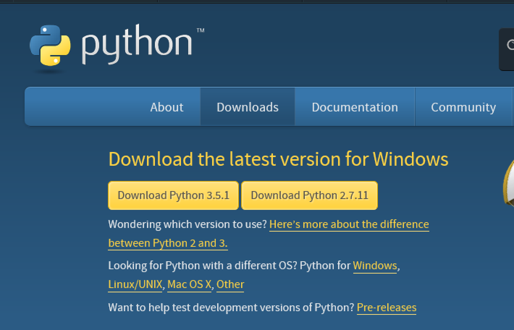
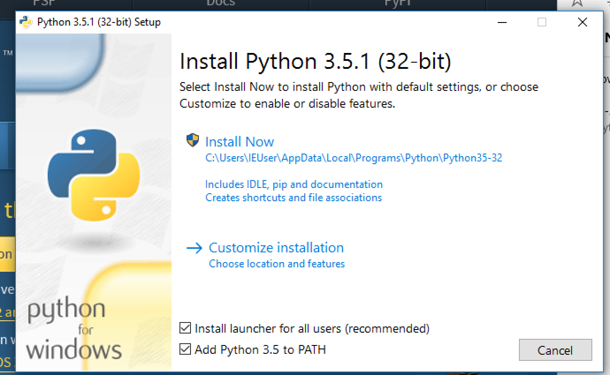
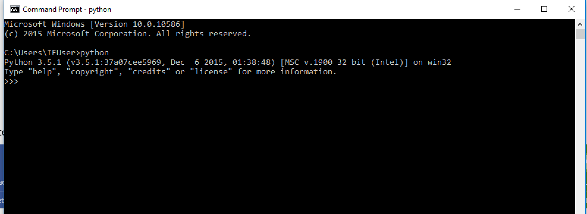
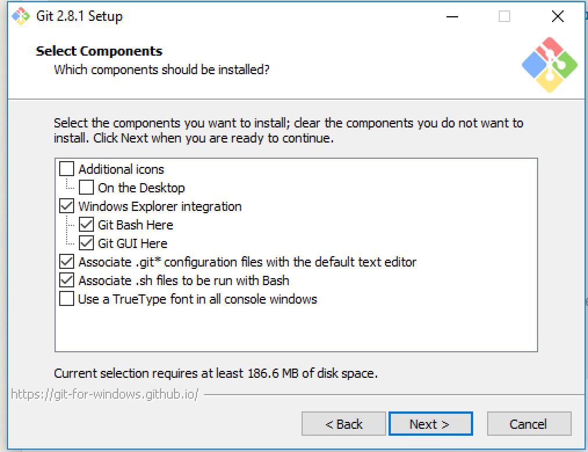
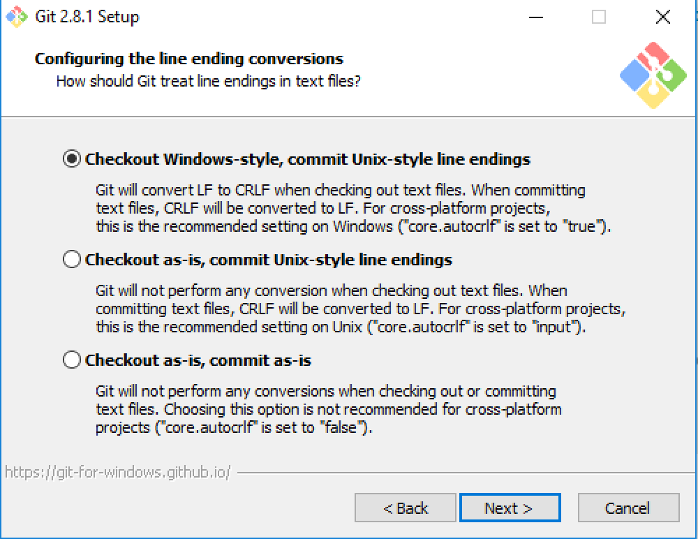
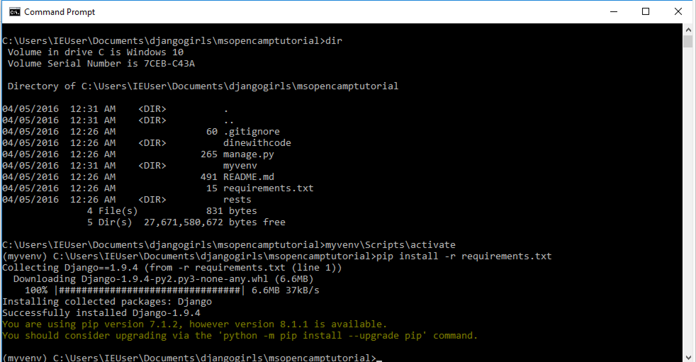

# Dinewithcode

## Prerequisites
  Python 3.5.x , Git (Windows,Mac), Atom

## Python
  get from http://www.python.org

  Check `add to path`

  Start command prompt and confirm python installation

## Git
  get from http://git-scm.com

  Check settings

  Select second option

  Select window style

//TODO: Add git global config (name and email)

## Atom
  get atom from https://atom.io

## Virtualenv & Django
  Install using pip

