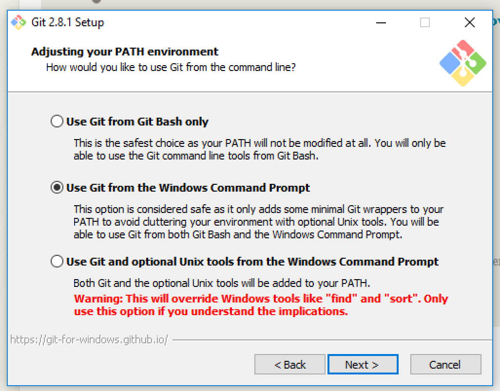

# Dinewithcode

## Prerequisites
  Python 3.5.x , Git (Windows,Mac), Atom

## Python
a. get from http://www.python.org

b. Check `add to path`

c. Start command prompt and confirm python installation

## Git
  get from http://git-scm.com

  a. Check settings
  

  b. Select second option

  c. Select window style

//TODO: Add git global config (name and email)

## Atom
  get atom from https://atom.io

## Virtualenv & Django

  a.Install using pip

