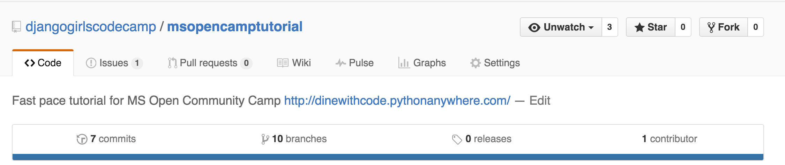
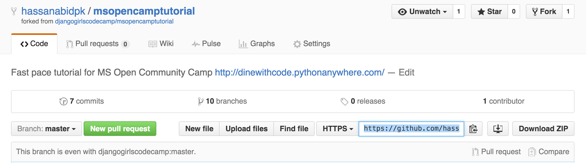

# Dinewithcode

## 시작하기
	준비사항 : Python 3.5.x , Git (Windows,Mac), Atom (미리 설치해두세요)

###### [설치 방법](https://github.com/djangogirlscodecamp/msopencamptutorial/blob/master/INSTALL.md)
---
## 이 튜토리얼을 찍고 내 리퍼지토리로 복사하세요. (Fork and clone this repository for Tutorial)
	a. 오른쪽 위에 있는 Fork 버튼을 누른다

	b. git clone 사용하여 `git clone https://github.com/<user_name>/msopencamptutorial.git`

	c. `cd msopencamptutorial`  치고 msopencamptutorial 폴더 안으로 이동
	d. 가상환경을 만든다. 윈도우의 경우 : `C:\Python35\python -m venv myvenv` 맥의 경우 : `python3 -m venv myvenv` 리눅스의 경우 : `virtualenv --python=python3.4 myvenv`를 콘솔에 치면 된다.
	e. 가상환경을 활성화 시킨다. 윈도우의 경우: `myvenv\Scripts\activate`  맥이나 리눅스의 경우  : `source myvenv/bin/activate` 를 치고, 요구되는 사항들을 옆의 명령어를 통해 설치한다. `pip install -r requirements`
	f. `python manage.py migrate` 통해 데이터 베이스를 만든다.
	g. 아래 데모를 4(b) 단계 부터 따라한다.

# 데모

## Step 1 [설치하기](http://tutorial.djangogirls.org/ko/deploy/#git-저장소-만들기)
	a. .gitignore 파일을 만들기
	b. 가상환경 사용하고 장고 설치하기 `pip install django` 그리고 requirements.txt 이렇게 만들기 `pip freeze > requirements.txt`

## Step 2 (프로젝트 시작하기)
	a. Django 프로젝트 시작하기 `django-admin startproject dinewithcode`

## Step 3 (설정 변경)
	a. Settings.py에서 TIME_ZONE있는 줄을 찾으세요. 그리고 이를 해당 시간대로 변경하세요 `TIME_ZONE = "Asia/Seoul"`  다음으로 정적파일 경로를 추가할 거에요. (정적 파일은 튜토리얼 후반부에서 CSS와 함께 다룰 거에요) 파일의 끝(end)으로 내려가서, STATIC_URL항목 바로 아래에 STATIC_ROOT을 추가하세요 `STATIC_ROOT = os.path.join(BASE_DIR, 'static')` )
	b. 데이터베이스 설정하기 블로그에 데이터베이스를 생성하기 위해서 콘솔창에서 이 코드를 `python manage.py migrate` 실행하세요. 이제 웹 서버를 시작해 웹사이트가 잘 작동하는지 확인해봐요! `python manage.py runserver`

## Step 4 (Django 모델/앱)
	a. rests 어플리케이션 제작하기 `python manage.py startapp rests`
	b. rests 글 모델 만들기 속성: name,address,phone_number,ratings,price,image, and createdAt fields
	c. 데이터베이스에 모델을 위한 테이블 만들기 `python manage.py makemigrations rests` 그리고 `python manage.py migrate` 실행하세요

## Step 5 [Django 관리자](http://tutorial.djangogirls.org/en/django_admin/#django-admin)
	a. 관리자 페이지에서 만든 모델을 보려면 admin.site.register(Restaurant)로 모델을 등록해야해요.
	b. 로그인을 하기 위해서는, 모든 권한을 가지는 슈퍼유저(superuser)를 생성해야해요. 커맨드라인으로 돌아가서 `python manage.py createsuperuser`을 입력하고 엔터를 누르세요. 브라우저로 돌아와서 장고 관리자 페이지에서 슈퍼유저로 로그인한 후 대시보드를 확인하세요

## Step 6 [배포하기](http://tutorial.djangogirls.org/ko/deploy/#github에서-pythonanywhere로-코드-가져오기)
	a. PythonAnywhere에서 무료 계정인 "초보자(Beginner)"로 회원가입 하세요. GitHub에서 PythonAnywhere로 코드 가져오기
	b. PythonAnywhere에서 가상환경(virtualenv) 생성하기. 콘솔창에서 `virtualenv --python=python3.4 myvenv` 그리고 `pip install -r requirements.txt` 실행하세요.정적 파일 모으기 `python manage.py collectstatic`
	c. PythonAnywhere에서 데이터베이스 생성하기 `python manage.py migrate`
	d. web app으로 Dinewithcode 배포하기 - 가상환경(virtualenv) 설정하기 그리고 WSGI 파일 설정하기

## Step 7 (Django Urls)
	a. 첫 번째 URL을 만들어 봅시다! 우리는 'http://127.0.0.1:8000/'가 홈페이지 주소로 만들어 글 목록이 보이게 만들어 볼 거에요.

## Step 8 (Django 뷰)
	a. Django 뷰 만들기. 뷰는 views.py 파일 안에 있습니다. 우리는 views 를 rests/views.py 파일 안에 추가할 거에요.

## Step 9 [Django 템플릿](http://tutorial.djangogirls.org/ko/template_extending/#템플릿-확장하기)
 	a. Bootstrap 사용하고 rest list 템플릿 만들기
	b. Bootstrap 사용하고 rest retail 템플릿 만들기
	c. 템플릿 확장하기

## Step 10 [템플릿의 동적 데이터](http://tutorial.djangogirls.org/en/dynamic_data_in_templates/#dynamic-data-in-templates)
	a. 쿼리셋
	b. rest 목록 템플릿 보여주기

## Step 11 (프로그램 어플리케이션 확장하기)
	a. Rest에 템플릿 링크 만들기 그리고 Rest 상세 페이지에 뷰 추가하기
	b. 다시한번 배포 하기

## Step 12 (Django 폼)
	a. 이제 한 가지만 더 하면 웹사이트가 완성되어요. 바로 식당을 추가하거나 수정하는 멋진 기능을 추가하는 것이죠. 폼과 페이지 링크 만들기
	b. 폼과 링크를 연결하고 저장된 폼에 View 메소드를 추가하기
	c. 폼 보안
	d. 폼 수정하기- 한 가지만 더: 배포하세요

## Step 13 (숙제)
	a. '점수' 목록 배열하기
	b. '가격' 목록 배열하기

## Step 14 (Extended)
